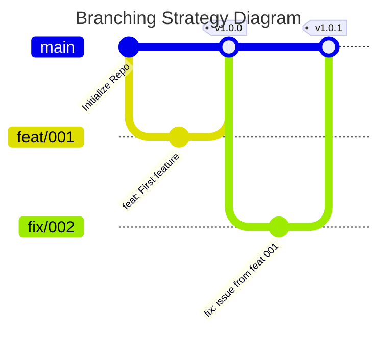
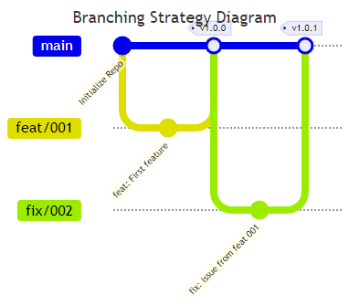

# Contributing Guidelines

## Branching Stratetgy

This project uses a trunk-based flow for git branching to simplify and speed up development. Using feat or fix branches that then get pull requested into main.


To update the bellow image:

```bash
npm install -g @mermaid-js/mermaid-cli
mmdc -i CONTRIBUTING.md -e png
```



## Git Commits

This project utilizes [Convential Commits](https://www.conventionalcommits.org/en/v1.0.0/#summary), as such commit messages should follow the bellow as taken from the convention:

```
<type>[optional scope]: <description>

[optional body]

[optional footer(s)]
```

The commit contains the following structural elements, to communicate intent to the consumers of your library:

fix: a commit of the type fix patches a bug in your codebase (this correlates with PATCH in Semantic Versioning).

feat: a commit of the type feat introduces a new feature to the codebase (this correlates with MINOR in Semantic Versioning).

BREAKING CHANGE: a commit that has a footer BREAKING CHANGE:, or appends a ! after the type/scope, introduces a breaking API change (correlating with MAJOR in Semantic Versioning). A BREAKING CHANGE can be part of commits of any type.

types other than fix: and feat: are allowed, for example @commitlint/config-conventional (based on the Angular convention) recommends build:, chore:, ci:, docs:, style:, refactor:, perf:, test:, and others.

footers other than BREAKING CHANGE: <description> may be provided and follow a convention similar to git trailer format.

Additional types are not mandated by the Conventional Commits specification, and have no implicit effect in Semantic Versioning (unless they include a BREAKING CHANGE). A scope may be provided to a commit’s type, to provide additional contextual information and is contained within parenthesis, e.g., feat(parser): add ability to parse arrays.

### Examples
#### Commit message with description and breaking change footer

```
feat: allow provided config object to extend other configs

BREAKING CHANGE: `extends` key in config file is now used for extending other config files
```

#### Commit message with ! to draw attention to breaking change

```
feat!: send an email to the customer when a product is shipped
```

#### Commit message with scope and ! to draw attention to breaking change

```
feat(api)!: send an email to the customer when a product is shipped
```

#### Commit message with both ! and BREAKING CHANGE footer

```
chore!: drop support for Node 6

BREAKING CHANGE: use JavaScript features not available in Node 6.
```

#### Commit message with no body

```
docs: correct spelling of CHANGELOG
```

#### Commit message with scope

```
feat(lang): add Polish language
```

#### Commit message with multi-paragraph body and multiple footers

```
fix: prevent racing of requests

Introduce a request id and a reference to latest request. Dismiss
incoming responses other than from latest request.

Remove timeouts which were used to mitigate the racing issue but are
obsolete now.

Reviewed-by: Z
Refs: #123
```

## Naming / Formatting Convention

This project follows the [Godot gdscript styleguide for formatting and naming](https://docs.godotengine.org/en/3.5/tutorials/scripting/gdscript/gdscript_styleguide.html)

### Summary

#### Naming Conventions
| Type         | Convention    | Info                               |
| ------------ | ------------- | ---------------------------------- |
| File names   | snake_case    | yaml_parsed.gd                     |
| class_name   | PascalCase    | YAMLParser                         |
| Node names   | PascalCase    |
| Functions    | snake_case    |
| Variables    | snake_case    |
| Signals      | snake_case    | always in past tense "door_opened" |
| Constants    | CONSTANT_CASE |
| enum names   | PascalCase    |
| enum members | CONSTANT_CASE |

*Prepend a single underscore (_) to virtual methods functions the user must override, private functions, and private variables:

#### Code Order

1. tool
1. class_name
1. extends
1. \# docstring
1. signals
1. enums
1. constants
1. exported variables
1. public variables
1. private variables
1. onready variables
1. optional built-in virtual _init method
1. built-in virtual _ready method
1. remaining built-in virtual methods
1. public methods
1. private methods