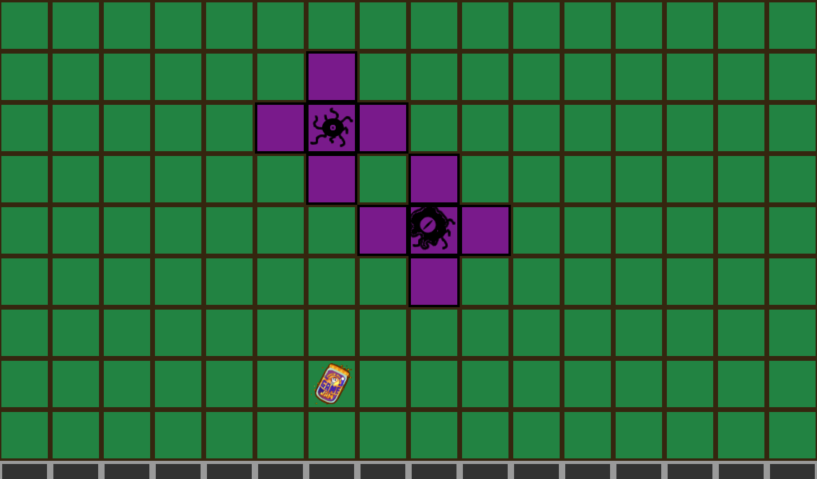

# Spread Game Design Document

)

By Dominik Kopec

For my submission to the 2024 [Pirate Software Game Jam 14](https://itch.io/jam/pirate).

## Introduction

### Game Summary Pitch

Spread is a tile based pixel art game that focuses on the satisfying feeling of fulling coloring in shapes.

### Inspiration

#### Starcraft

The Starcraft Zerg Queen unit is the primary inspiration for the game play, when I though about spreading, this game unit came to the forfrom of my mind.

### Player Experience

The player moves their character around by clicking spots on the screen that they want to infect with creeps the goal being to cover the entire map.

### Platform

The game is developed and release to be multiplatform, currently windows desktop and browser.

### Development Software

- Programming: [Godot Engine v3.5.2](https://godotengine.org/download/3.x/windows/)
- Art: [Gimp](https://www.gimp.org/)
- Audio: [LMMS](https://lmms.io/)

### Genre

### Target Audience

With a simple but satisfying mechanic, this game is perfect for all casual players.

## Concept

### Gameplay overview

The player controls their creep spreader, in order to place creepers and spread throughout the map.

### Theme Interpretation (Its Spreading)

> 'Spreading' interpretation - The player must take over everything to win. Grow or die!

Within the context of the game the only way to win is to spread your influence, the faster the better.

### Primary Mechanics

#### Walls

A boundary to designate the area needed to win.

#### Creep

Displays progress towards winning.

#### Creepers

Required to place creep.

### Secondary Mechanics

N/A

## Art

### Theme Interpretation

Following the idea of alien take over and the spreading of influence the game uses contrast between "natural" colors, a simple pallet of green, brown, purple and black allows for this.

### Design

Some creepy alien vibes.

## Audio

No audio as I didn't have time.

### Music

N/A

### Sound Effects

N/A

## Game Experience

### UI
No ui, ran out of time.

### Controls
Mouse/touchscreen

### Development Timeline

Didn't make a proper one to my own detriment, here is a general overview of home the development went:

https://github.com/dkopec/pirate-software-game-jam-14/releases?page=3

- 2021-01-12 - Setup Github Repo/CICD/Itchio publishing, godot project skeleton, main menu.
- 2021-01-13 - Added Spreading Mechanic, worked on figuring out how to make the game enaging
- 2021-01-15 - Added some more UI elements
- 2021-01-22 - Decided to refactor so that I can actually move the character with Astar navigation.
- 2021-01-25 - wrote bulk of the Design Doc
- 2021-01-26 - Last minute crunch, implemented win condition, target assignment, powerup